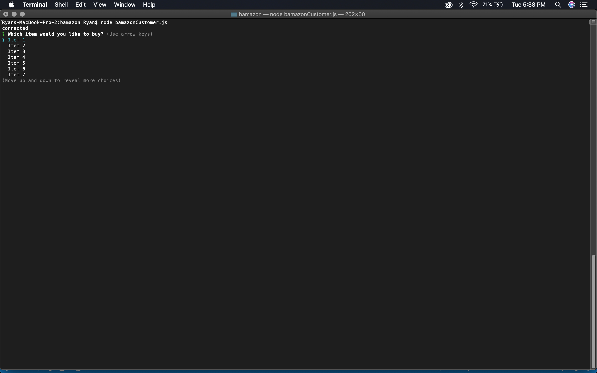
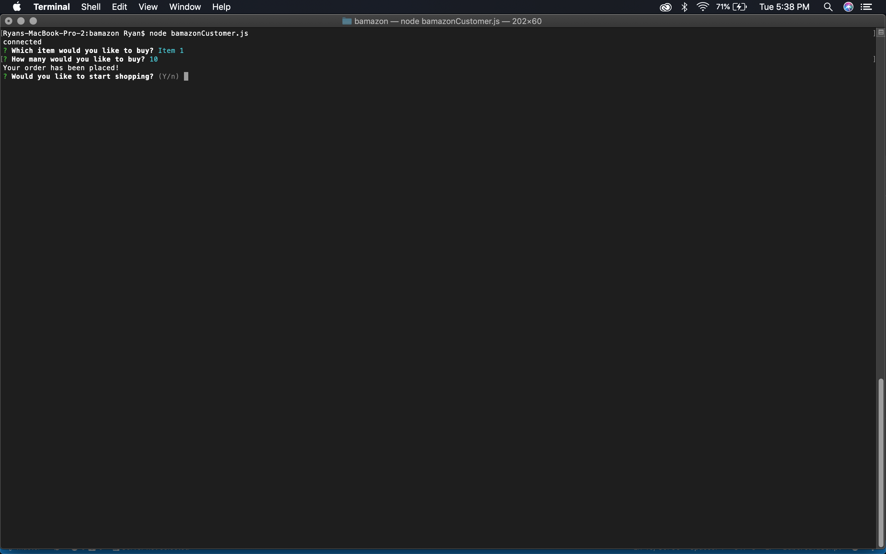
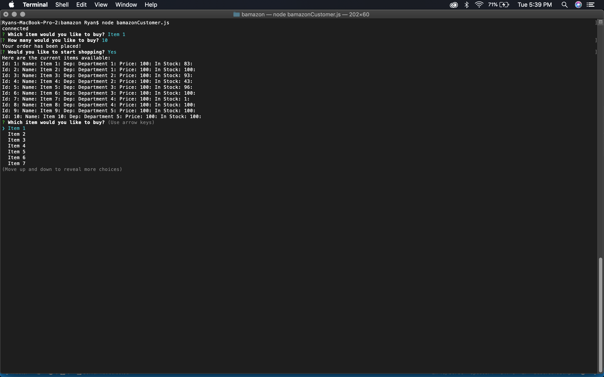
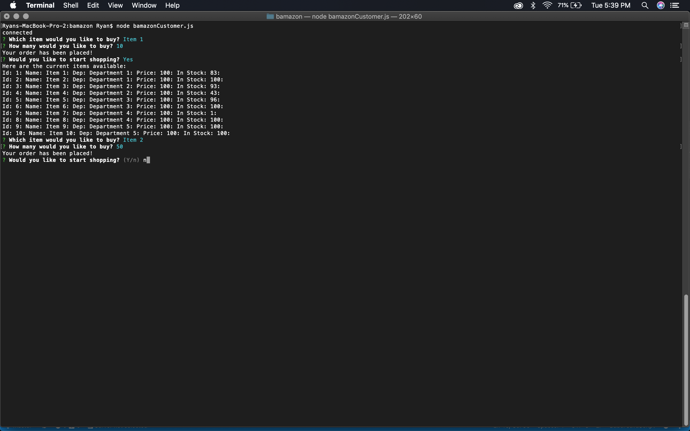
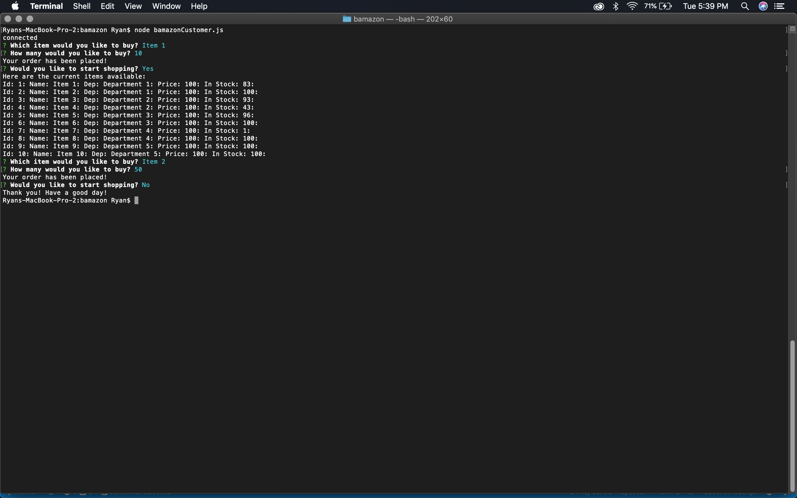

# Bamazon CLI App
### A CLI app by Ryan Harris

## Explanation
---
Bamazon is a basic Amazon clone run in the Terminal. It allows the user to select from 10 different items and then choose how many of that item they would like to "purchase." After doing so, the app prints "Your order has been placed!" and asks the user if they would like to continue shopping. If they say Yes, the app displays updated stock levels for each item and the process repeats. However, if the user says No, then the app prints "Thank you! Have a good day!" and exits the program.

Screenshots demonstrating this are below.
---
## Langauges used:
---
- MySQL
- Node.JS

## Screenshots:
---
Prompts the user to select which of the 10 items they would like to buy:

Prompts the user to input how many they would like to buy of that item and then asks if they would like to continue shopping:

If the user says Yes, the app lists current stock of each of the 10 items and repeats the same process:

If the user says No...:

The app prints "Thank you! Have a good day!" and exits the app:

